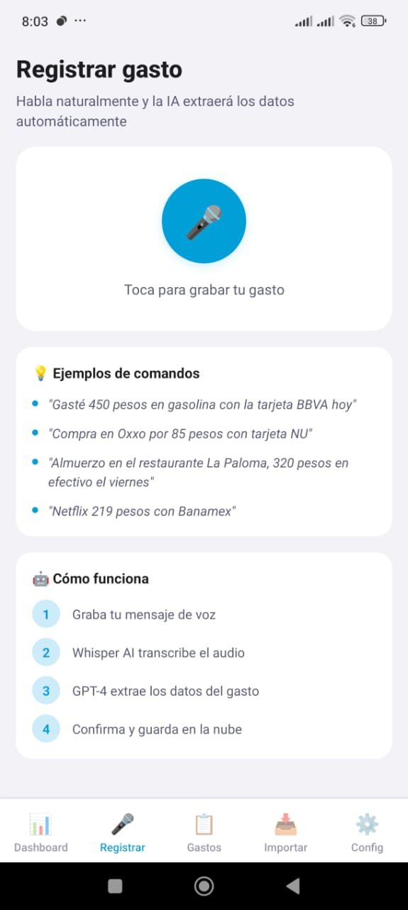
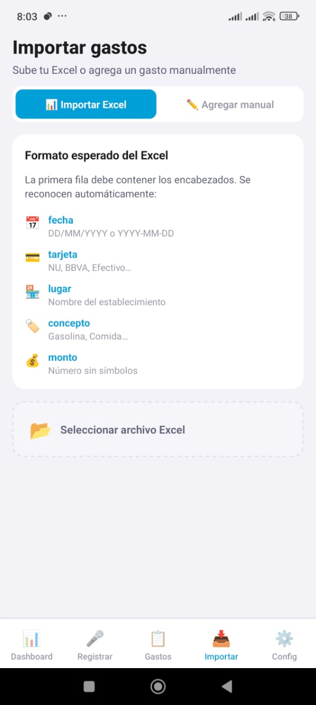

# DashVoice 🎙️💸

**Dashboard financiero personal con registro de gastos por voz**, construido con React Native + Expo. Habla naturalmente y la inteligencia artificial extrae automáticamente los datos de tu gasto y los guarda en la nube.

---

## Capturas de pantalla

| Dashboard | Registro por voz | Mis Gastos |
|:---------:|:----------------:|:----------:|
|  |  |  |

| Importar | Configuración |
|:--------:|:-------------:|
|  |  |

> **Nota:** Para agregar capturas, crea la carpeta `assets/screenshots/` y guarda las imágenes con los nombres indicados arriba.

---

## Características principales

- **Registro por voz** — graba un mensaje como *"Gasté 450 pesos en gasolina con la tarjeta BBVA"* y la IA extrae monto, lugar, concepto y tarjeta de forma automática
- **Dashboard interactivo** — gráficas con cross-filtering: filtra por mes, concepto, tarjeta o establecimiento y todos los demás gráficos se actualizan en tiempo real
- **KPIs financieros** — gasto anual, mensual, comparativa vs mes anterior y variación porcentual
- **Historial de gastos** — búsqueda en tiempo real, filtros avanzados y eliminación de registros
- **Importación masiva** — sube archivos Excel (.xlsx) o CSV y mapea las columnas automáticamente
- **Exportación** — descarga tus gastos en formato Excel o CSV con un toque
- **Temas visuales** — 4 temas incluidos: Default, Oscuro, Claro y Neon
- **Alertas de presupuesto** — notificaciones cuando alcanzas el porcentaje de gasto mensual configurado
- **Sincronización en la nube** — backend con Supabase, tus datos disponibles desde cualquier dispositivo

---

## Stack tecnológico

| Capa | Tecnología |
|------|-----------|
| Framework | React Native + Expo 51 |
| Navegación | Expo Router (file-based) |
| Estado global | Zustand |
| Backend / DB | Supabase (PostgreSQL) |
| IA - Transcripción | OpenAI Whisper |
| IA - Extracción de datos | GPT-4 |
| Gráficas | react-native-chart-kit + D3 Treemap |
| Animaciones | React Native Reanimated |
| Exportación | XLSX (SheetJS) |
| Notificaciones | expo-notifications |

---

## Requisitos previos

- [Node.js](https://nodejs.org/) 18 o superior
- [Expo CLI](https://docs.expo.dev/get-started/installation/) — `npm install -g expo-cli`
- Una cuenta en [Supabase](https://supabase.com/) (gratuita)
- Una API Key de [OpenAI](https://platform.openai.com/) con acceso a Whisper y GPT-4

---

## Instalación rápida

### 1. Clonar el repositorio

```bash
git clone https://github.com/EfrenF454/DashVoice.git
cd DashVoice
```

### 2. Instalar dependencias

```bash
npm install
```

### 3. Configurar variables de entorno

Crea un archivo `.env` en la raíz del proyecto:

```env
EXPO_PUBLIC_SUPABASE_URL=https://tu-proyecto.supabase.co
EXPO_PUBLIC_SUPABASE_ANON_KEY=tu-anon-key
EXPO_PUBLIC_OPENAI_API_KEY=sk-...
```

### 4. Configurar Supabase

Ejecuta el siguiente SQL en el editor de Supabase para crear la tabla de gastos:

```sql
create table gastos (
  id          uuid primary key default gen_random_uuid(),
  user_id     uuid references auth.users not null,
  fecha       date not null,
  lugar       text not null,
  concepto    text not null,
  tarjeta     text not null,
  monto       numeric(10,2) not null,
  created_at  timestamptz default now()
);

-- Habilitar Row Level Security
alter table gastos enable row level security;

create policy "Usuarios ven sus propios gastos"
  on gastos for all
  using (auth.uid() = user_id);
```

### 5. Iniciar la app

```bash
npx expo start
```

Escanea el código QR con la app **Expo Go** en tu celular, o presiona `a` para Android / `i` para iOS en el simulador.

---

## Tutorial rápido

### Registrar un gasto por voz

1. Abre la app e inicia sesión
2. Ve a la pestaña **Voz** (ícono de micrófono)
3. Toca el botón grande para empezar a grabar
4. Habla naturalmente, por ejemplo:
   - *"Compré en Walmart 850 pesos con tarjeta BBVA el lunes"*
   - *"Almuerzo en el restaurante 320 pesos en efectivo"*
   - *"Netflix 219 pesos con Banamex"*
5. Detén la grabación — la IA transcribe y extrae los datos automáticamente
6. Revisa los datos en el modal de confirmación, ajusta si es necesario y toca **Guardar**

### Explorar el dashboard

1. Ve a la pestaña **Inicio**
2. Desliza hacia abajo para ver todas las gráficas
3. Toca cualquier barra, sección del pastel o establecimiento para **filtrar** el resto de gráficas
4. Aparecen chips en la parte superior con los filtros activos — tócalos para quitarlos
5. Jala hacia abajo para recargar los datos

### Importar gastos desde Excel

1. Ve a la pestaña **Importar**
2. Toca **Seleccionar archivo** y elige tu archivo `.xlsx` o `.csv`
3. La app detecta automáticamente las columnas (fecha, lugar, concepto, tarjeta, monto)
4. Revisa la vista previa de los primeros registros
5. Toca **Importar todos** para guardar en la nube

### Exportar tus gastos

1. Ve a la pestaña **Gastos**
2. Aplica los filtros que desees (fecha, tarjeta, concepto)
3. Toca el ícono 📤 en la esquina superior derecha
4. Elige **Excel** o **CSV**

### Configurar presupuesto y alertas

1. Ve a la pestaña **Configuración**
2. Ingresa tu presupuesto mensual en pesos
3. Activa las alertas y define el porcentaje (por defecto 80%)
4. Recibirás una notificación cuando estés cerca del límite

---

## Temas disponibles

| Tema | Descripción |
|------|-------------|
| **Default** | Azul/morado con fondo oscuro |
| **Dark** | Gris oscuro neutro |
| **Claro** | Fondo blanco para uso diurno |
| **Neon** | Verde neón con efecto glow |

Cámbialos desde **Configuración → Tema**.

---

## Estructura del proyecto

```
DashVoice/
├── app/
│   ├── (tabs)/
│   │   ├── index.tsx        # Dashboard con gráficas
│   │   ├── voz.tsx          # Registro por voz
│   │   ├── gastos.tsx       # Historial de gastos
│   │   ├── importar.tsx     # Importación de archivos
│   │   └── configuracion.tsx
│   └── login.tsx
├── components/              # Componentes reutilizables
│   └── charts/              # Gráficas (barras, donut, treemap, etc.)
├── services/
│   ├── supabase.ts          # Operaciones CRUD
│   └── openai.ts            # Whisper + GPT-4
├── store/                   # Estado global con Zustand
├── contexts/                # Auth y Tema
└── constants/               # Categorías, colores y temas
```

---

## Licencia

MIT © [Efren](https://github.com/EfrenF454)
